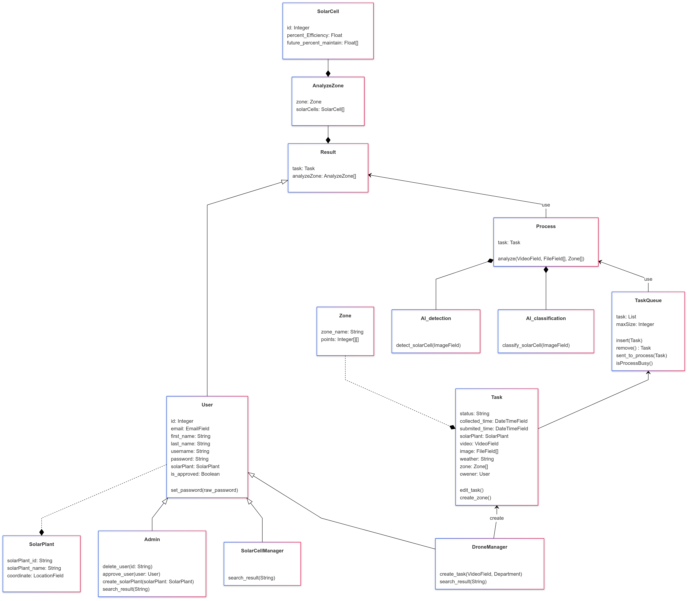

# Plan

## Framework

[Figma](https://www.figma.com/design/H55Y0SL7eFCuN9tyDWsRBZ/FinalProject?node-id=0-1&node-type=canvas&t=HA5cRkeajVKo9l6l-0)

[Prototype](https://www.figma.com/proto/H55Y0SL7eFCuN9tyDWsRBZ/FinalProject?node-id=1-4&t=fcVgUi05HI2cALp7-0&scaling=min-zoom&content-scaling=fixed&page-id=0%3A1&starting-point-node-id=1%3A4)

## Class Diagram

[Mermaid](https://www.mermaidchart.com/app/projects/b4e0db4d-f33a-4278-9622-4070bdc657b3/diagrams/351d0943-2efc-4f8b-9679-a030bee150d4/version/v0.1/edit)

